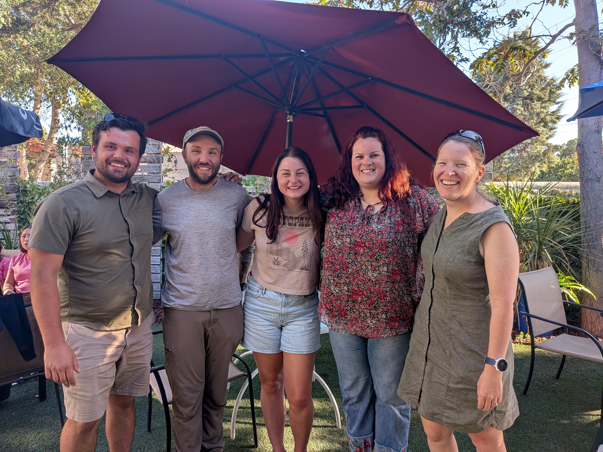

```{r setup, include=FALSE}
knitr::opts_chunk$set(echo = FALSE)

# Learn more about creating websites with Distill at:
# https://rstudio.github.io/distill/website.html

```

```{css}
d-title {
    display: none;
  }
```


```{r layout="l-screen", echo=FALSE}
knitr::include_graphics("images/banners/ocotillo-2.JPG")
```

<h2>The Laverty Lab</h2>

We are a conservation science and wildlife ecology lab in the [Department of Fish, Wildlife and Conservation Ecology](https://fwce.nmsu.edu/) at [New Mexico State University](https://nmsu.edu/). 

````{r, fig.align = "center", out.width = "80%", fig.cap="October 2025 lab photo of Taylor Pichler, Matt Becker, Iona Rohan, Holly Whited, and Theresa Laverty. Missing Brandi Stevenson."}

````

<h2>Recent Lab News</h2>

**19-Dec-2025:** Theresa will be coadvising Melanie Solis Alvarez's M.S. project with Dr. Wiebke Boeing beginning this spring. Welcome to the lab, Melanie!

**17-Nov-2025:** Flor Calderón and Ryan Moore will be joining the lab as new Ph.D. students in the spring. Welcome, Flor and Ryan!

**01-Oct-2025:** Congratulations to Iona Rohan for successfully defending her M.S. thesis today! Her work focused on the effects of wind energy on the habitat use of terrestrial mammals in central New Mexico.

**28-Jul-2025:** Theresa coauthored a [publication](https://doi.org/10.1186/s13071-025-06805-z) out today in *Parasites & Vectors* on the ectoparasites of two of Madasgascar's fruit bats. 

**15-Jul-2025:** Theresa had two publications come out this week! Check out [the bat PIT tag paper](https://www.eaglehill.us/nabr-pdfs-special/nabr-008-Waag.pdf) in *Journal of North American Bat Research* and [the paper](https://doi.org/10.1111/cobi.70108) highlighting the underrepresentation of bats in Africa's protected areas in *Conservation Biology*. 

**30-May-2025:** We're excited to have Matt Becker joining the Frey and Laverty labs as a new Master's student in the fall. Welcome, Matt!

**14-May-2025:** MSc student Taylor Pichler received the Ecological Society of America's Forrest Shreve Student Research Award. Congrats, Taylor!

**14-Apr-2025:** MSc student Holly Whited was awarded the Southwestern Association of Naturalists' Howard McCarley Student Research Grant. Congrats, Holly!

**12-Apr-2025:** Theresa and Brandi had [a new paper](https://onlinelibrary.wiley.com/share/author/W4BV2K4ZKQMWG5TARAWJ?target=10.1002/ecy.70067) published this week in *Ecology* and [a companion photo gallery](https://doi.org/10.1002/bes2.70016) in *The Bulletin of the Ecological Society of America* highlighting lesser long-nosed bat movements as far as 1631 km!

**02-Dec-2024:** Theresa coauthored [a new data paper](https://doi.org/10.1038/s41597-024-04170-7) published today in *Scientific Data* featuring > 17,000 curated locality records of African bats.

**19-Sept-2024:** The Frey and Laverty labs received funding from the Bureau of Land Management to continue researching the effects of wind energy development on terrestrial mammals. Visit [Join the Lab](https://lavertylab.org/join-the-lab) for MS and eventual undergraduate position listings. 

**17-Jul-2024:** We're excited to have Taylor Pichler joining the lab as a new Master's student in the fall. Welcome, Taylor!

**07-Jun-2024:** The Laverty Lab received funding from the Southwest Border Resource Protection Program to continue monitoring bats of greatest conservation need. 

**05-Jun-2024:** The lab received [an NSF BRC-BIO program award](https://www.nsf.gov/awardsearch/showAward?AWD_ID=2335008&HistoricalAwards=false). Stay tuned for MS and undergraduate position announcements! Visit [Join the Lab](https://lavertylab.org/join-the-lab).

**20-Nov-2023:** Theresa coauthored [a new paper](https://rdcu.be/drzoK) published in *Nature Ecology & Evolution*.

**26-Jun-2023:** Holly Whited will be joining the lab as a new Master's student in the fall. Welcome!

**04-May-2023:** Theresa has [a new paper](https://doi.org/10.1093/biosci/biad032) out in *BioScience*. 

**09-Jan-2023:** The Laverty Lab officially opens its doors at NMSU!

<!-- **11-25-2022:** Two new Master's students are joining the lab this January. Welcome Iona Rohan (co-advised by [Dr. Jennifer Frey](https://fwce.nmsu.edu/faculty-staff/jennifer-frey.html)) and Brandi Stevenson -->

<!-- **08-08-2022:** Theresa accepted an offer to join the Department of Fish, Wildlife and Conservation Ecology at New Mexico State University starting January 2023. The Laverty Lab begins!  -->

<center>

</center>
