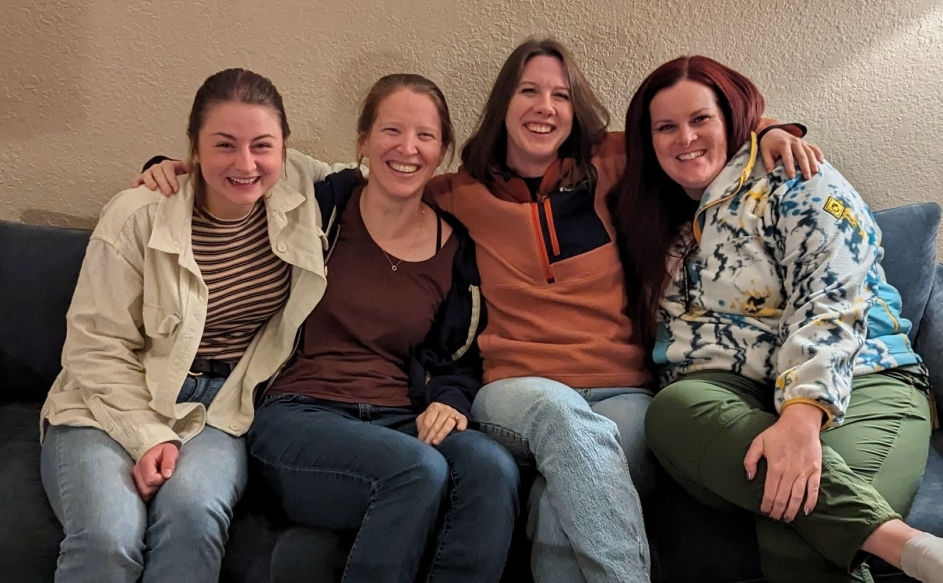

```{r setup, include=FALSE}
knitr::opts_chunk$set(echo = FALSE)

# Learn more about creating websites with Distill at:
# https://rstudio.github.io/distill/website.html

```

```{css}
d-title {
    display: none;
  }
```


```{r layout="l-screen", echo=FALSE}
knitr::include_graphics("images/banners/ocotillo-2.JPG")
```

<h2>The Laverty Lab</h2>

We are a conservation science and wildlife ecology lab in the [Department of Fish, Wildlife and Conservation Ecology](https://fwce.nmsu.edu/) at [New Mexico State University](https://nmsu.edu/). 

````{r, fig.align = "center", out.width = "80%", fig.cap="December 2023 lab photo of Iona Rohan, Theresa Laverty, Brandi Stevenson, and Holly Whited."}

````

<h2>Recent Lab News</h2>

<<<<<<< HEAD
**2-Dec-2024:** Theresa coauthored [a new data paper](https://doi.org/10.1038/s41597-024-04170-7) published today in Scientific Data featuring > 17,000 curated locality records of African bats.

**19-Sept-2024:** The Frey and Laverty labs received funding from the Bureau of Land Management to continue researching the effects of wind energy development on terrestrial mammals. Visit [Join the Lab](https://lavertylab.org/join-the-lab) for MS and eventual undergraduate position listings. 

**17-Jul-2024:** We're excited to have Taylor Pichler joining the lab as a new Master's student in the fall. Welcome, Taylor!

**07-Jun-2024:** The Laverty Lab received funding from the Southwest Border Resource Protection Program to continue monitoring bats of greatest conservation need. 

**05-Jun-2024:** The lab received [an NSF BRC-BIO program award](https://www.nsf.gov/awardsearch/showAward?AWD_ID=2335008&HistoricalAwards=false). Stay tuned for MS and undergraduate position announcements! Visit [Join the Lab](https://lavertylab.org/join-the-lab).

**20-Nov-2023:** Theresa coauthored [a new paper](https://rdcu.be/drzoK) published in Nature Ecology & Evolution.

**26-Jun-2023:** Holly Whited will be joining the lab as a new Master's student in the fall. Welcome!

**04-May-2023:** Theresa has [a new paper](https://doi.org/10.1093/biosci/biad032) out in BioScience. 

**09-Jan-2023:** The Laverty Lab officially opens its doors at NMSU!

<!-- **11-25-2022:** Two new Master's students are joining the lab this January. Welcome Iona Rohan (co-advised by [Dr. Jennifer Frey](https://fwce.nmsu.edu/faculty-staff/jennifer-frey.html)) and Brandi Stevenson -->

<!-- **08-08-2022:** Theresa accepted an offer to join the Department of Fish, Wildlife and Conservation Ecology at New Mexico State University starting January 2023. The Laverty Lab begins!  -->

<center>

</center>
