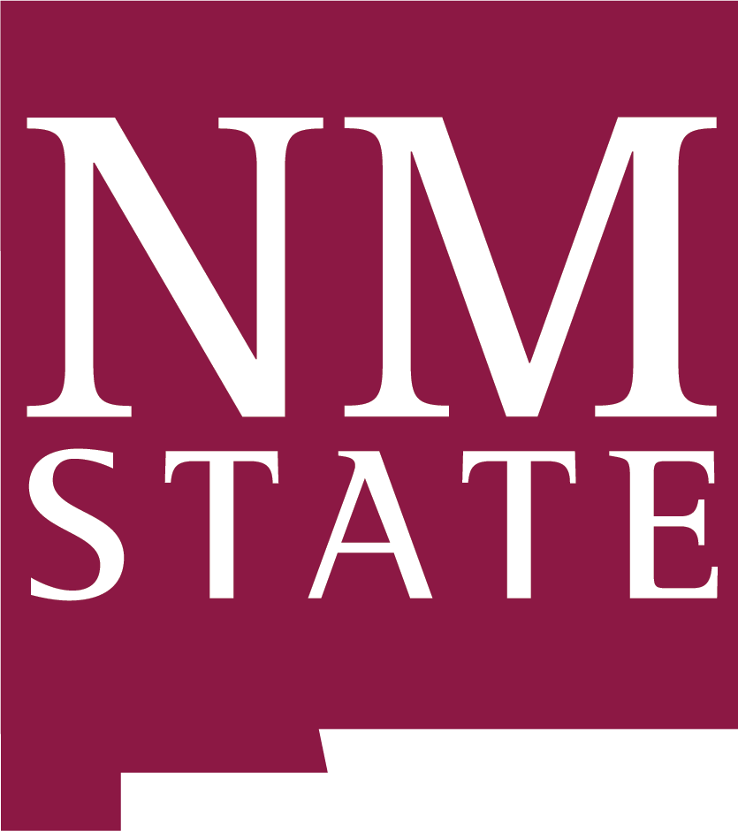

```{r setup, include=FALSE}
knitr::opts_chunk$set(echo = FALSE)

# Learn more about creating websites with Distill at:
# https://rstudio.github.io/distill/website.html

```

```{css}
d-title {
    display: none;
  }
```


```{r layout="l-screen", echo=FALSE}
knitr::include_graphics("images/banners/ocotillo.JPG")
```

<h2>The Laverty Lab</h2>

We are a conservation science and wildlife ecology lab in the [Department of Fish, Wildlife, and Conservation Ecology](https://fwce.nmsu.edu/) at [New Mexico State University](https://nmsu.edu/). We will be opening our doors in Las Cruces in January 2023!

<h2>Recent Lab News</h2>

**08-08-2022:** Theresa accepted an offer to join the Department of Fish, Wildlife, and Conservation Ecology at New Mexico State University starting January 2023. The Laverty Lab begins! 

<center>

</center>
