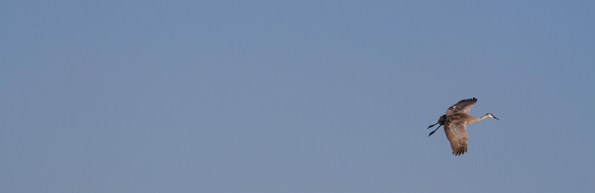

```{r setup, include=FALSE}
knitr::opts_chunk$set(echo = FALSE)
```

```{css}
d-title {
    display: none;
  }
```


```{r layout="l-screen", echo=FALSE}

```

<h2>Join the Lab</h2>
Current openings (i.e., funded work for which our lab is actively seeking a graduate student or postdoc) are listed below and are advertised on job boards, such as the [Texas A&M Wildlife and Fisheries Sciences job board](https://wfscjobs.tamu.edu/job-board/). The Laverty Lab only takes on graduate students or postdocs when there is funding to support their research and an adequate stipend. If you have external funding, or would like to discuss a fellowship application or other opportunity, please send Theresa an email at [tlaverty {at} uchicago.edu](mailto:tlaverty@uchicago.edu). Applicants from underrepresented backgrounds, ethnicities, genders, sexual orientations, and lifestyles are enthusiastically encouraged to apply to any of the positions outlined below.

## Prospective graduate students:

Theresa will be starting in January 2023 as an assistant professor in the [Department of Fish, Wildlife, and Conservation Ecology](https://fwce.nmsu.edu/) at New Mexico State University. **The Laverty Lab currently has funding through a combination of research and teaching assistantships for 3 new students to begin in 2023.** We are looking for motivated students with broad interests in population and community ecology, conservation biology, and/or animal behavior who are eager to undertake a multi-faceted MS or PhD involving some combination of field study, molecular work, and modeling. 

**Current openings:**  

  * MS assistantship (co-advised with [Dr. Jennifer Frey](https://fwce.nmsu.edu/faculty-staff/jennifer-frey.html)) focused on the effects wind energy on ungulates, carnivores, and lagomorphs. This position is funded for 2.5 years and will begin in January 2023. Apply by **23 September 2022** for full consideration. 
  
<center>
<div style="display: inline-block"><a href="attachments/openings/2023 Wind Energy Graduate assistantship.pdf" class="icon-link" target="_blank" rel="noopener"><i class="fa fa-file-pdf"></i> Full position description</a></div><div style="display: inline-block"><a href="https://airtable.com/shrHIGeKeR2P0vdSo" class="icon-link" target="_blank" rel="noopener"><i class=""></i> Apply here</a> 
</div>
</center>
  
  * MS or PhD assistantships in applied population and community ecology. These positions will likely focus on bats in the southwestern United States with anticipated start dates in January or summer 2023. The lab has currently secured 2-3 years of funding for two positions. Apply by **7 October 2022** for full consideration. 

<center>
<div style="display: inline-block"><a href="attachments/openings/2023_GraduateAssistantships.pdf" class="icon-link" target="_blank" rel="noopener"><i class="fa fa-file-pdf"></i> Full position description</a></div><div style="display: inline-block"><a href="https://airtable.com/shrLmf8ZuZ4XPRN9w" class="icon-link" target="_blank" rel="noopener"><i class=""></i> Apply here</a> 
</div>
</center>
  
If you are interested in securing your own funding as you apply for graduate programs, Theresa is happy to assist with fellowship applications to programs such as the [NSF Graduate Research Fellowship Program](https://www.nsfgrfp.org/), the [Ford Foundation Fellowship Program](https://sites.nationalacademies.org/PGA/FordFellowships/index.htm), the [US Fulbright Program](https://us.fulbrightonline.org/), the [DOE Computational Science Graduate Fellowship](https://www.krellinst.org/csgf/), etc. Similarly, Theresa would be happy to work with prospective international students on applications for the [Fulbright Foreign Student Program](https://foreign.fulbrightonline.org/about/foreign-student-program), a [WWF Russell E. Train Fellowship](https://www.worldwildlife.org/projects/russell-e-train-fellowships), or other opportunities. If you would like to pursue a fellowship application, send an email to [tlaverty {at} uchicago.edu](mailto:tlaverty@uchicago.edu) containing a short explanation of an idea you'd like to pursue, a pathway for pursuing it (e.g., a link to a funding source), and a CV with contact information for at least three references.

## Prospective postdocs:

The Laverty Lab is always interested in hearing from prospective postdocs. While we currently do not have funding for postdocs in our lab, Theresa is happy to work with any interested individuals on related fellowship or grant applications to secure independent funding (via a [NSF Postdoctoral Research Fellowship in Biology](https://beta.nsf.gov/funding/opportunities/postdoctoral-research-fellowships-biology-prfb), a [David H. Smith Conservation Research Fellowship](https://conbio.org/mini-sites/smith-fellows), a [L’Oreal USA Women in Science Fellowship](https://www.loreal.com/en/usa/pages/group/fwis/), etc.). If you are interested in pursuing this option, send Theresa an email at [tlaverty {at} uchicago.edu](mailto:tlaverty@uchicago.edu) containing a short explanation of an idea you'd like to pursue, a pathway for pursuing it (e.g., a link to a funding source), and a CV with contact information for at least three references.

## Prospective undergrads:

The Laverty Lab is always willing to work with eager and motivated undergraduate researchers. If you are interested in working in our lab, please send Theresa an email at [tlaverty {at} uchicago.edu](mailto:tlaverty@uchicago.edu) with your research interest and any potential project ideas.

## Beyond our lab:

If you are interested in finding research positions when opportunities are limited in our lab, you may want to explore the following job boards:

- [Texas A&M Wildlife and Fisheries Sciences job board](https://wfscjobs.tamu.edu/job-board/)  
- [EcoEvoJobs.net](https://ecoevojobs.net/)  
- [NSF Research Experiences for Undergraduates](https://www.nsf.gov/crssprgm/reu/index.jsp)
- ECOLOG-L listserv (note you need to register first for access- [instructions here](https://halllab.asu.edu/how-to-join-the-ecolog-job-board/))
- MAMMAL-L listserv (note you need to register first for access- [instructions here](http://www.lsoft.com/scripts/wl.exe?SL1=MAMMAL-L&H=SI-LISTSERV.SI.EDU))
- [Society for Conservation Biology job board](https://careers.conbio.org/)
- [Primate-jobs](https://groups.google.com/a/g-groups.wisc.edu/g/primate-job)
- [Wildlife Disease Association job board](https://www.wildlifedisease.org/PersonifyEbusiness/Opportunities/Careers)
- [Society for Integrative & Comparative Biology job board](https://sicb.org/jobs-and-fellowships/)
- [IDDjobs](https://iddjobs.org/)
- [Ornithology Exchange job board](https://ornithologyexchange.org/jobs/board/)