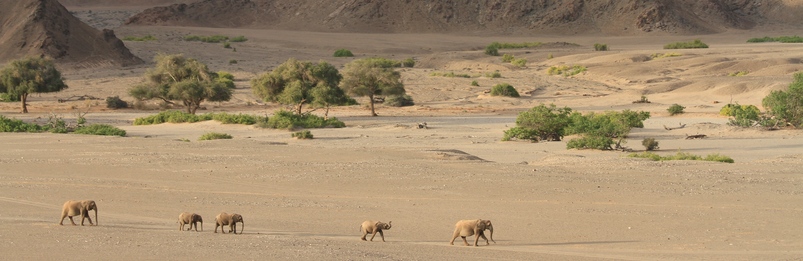
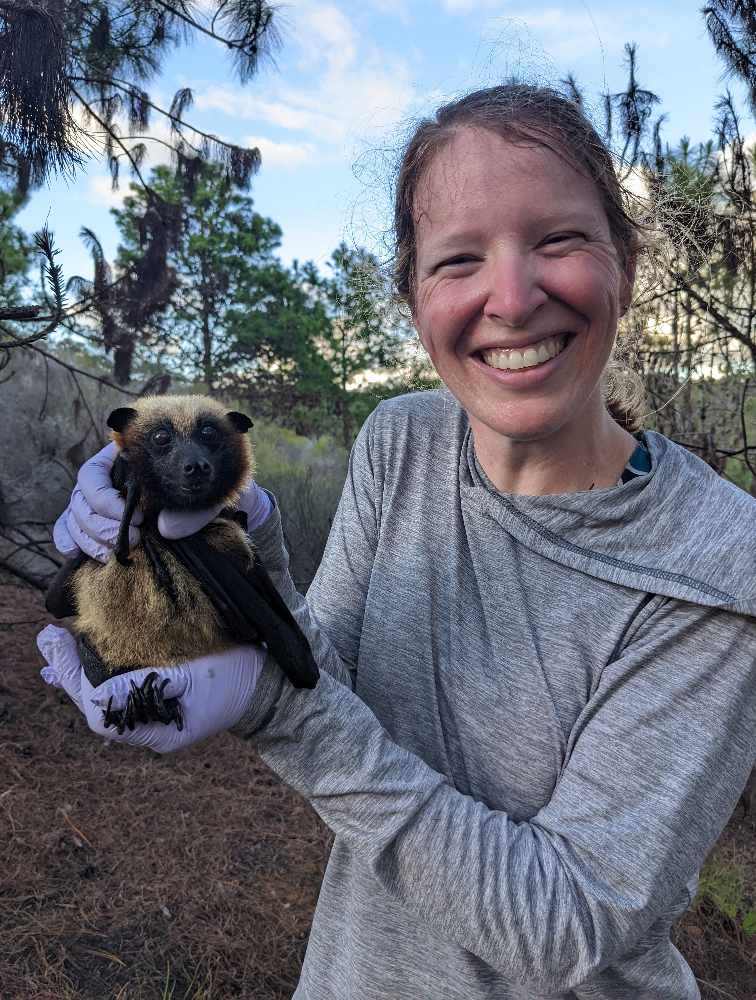
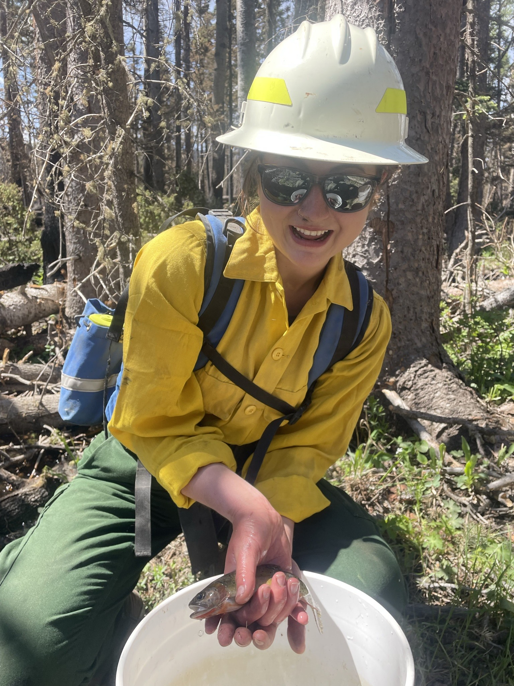
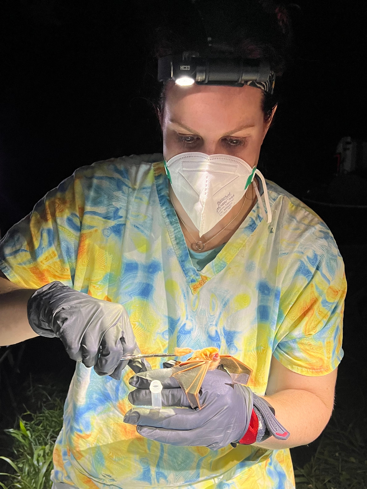

```{r setup, include=FALSE}
knitr::opts_chunk$set(echo = FALSE, R.options = list(width = 60))
source(file.path("R", "functions.R"))
library(distilltools)
```

```{css}
d-title {
    display: none;
  }
```

```{r layout="l-screen", echo=FALSE}

```

## Principal Investigator
:::float-left



### Theresa M. Laverty, Ph.D.

Theresa Laverty (she/her) is an Assistant Professor in the [Department of Fish, Wildlife and Conservation Ecology](https://fwce.nmsu.edu/) at [New Mexico State University](https://nmsu.edu/). Her research answers questions rooted in applied population and community ecology and often takes place outside of protected areas where humans, livestock, and wildlife interact. While she has studied diverse species (e.g., beach-nesting birds, caiman, red squirrels, elephants, and mountain gorillas), Theresa's research for the last decade has largely focused on bats. In addition to the southwestern United States, she has worked extensively in parts of Africa (Namibia, Madagascar, Kenya, and Uganda) as well as the Peruvian Amazon. She combines ecological research with social science methods to understand the basic ecology of a system, including the roles people play in the environment, in hopes of providing information that can assist managers and conservation scientists to make informed decisions. Prior to NMSU, Theresa was a postdoctoral scholar at Colorado State University and the University of Chicago. She holds a PhD in [Fish, Wildlife, and Conservation Biology](https://warnercnr.colostate.edu/fwcb/) from Colorado State University and a BA in [Ecology and Evolutionary Biology](https://eeb.princeton.edu/) from Princeton University. When she is not behind a computer or out in the field, Theresa enjoys all things outdoors—trail running, backpacking, fishing, photographing wildlife, etc.

:::

<center>
<div style="display: inline-block">
<a href="attachments/Laverty_CV.pdf" class="icon-link" target="_blank" rel="noopener"><i class=""></i> CV</a> </div><div style="display: inline-block">
<a href="https://scholar.google.com/citations?user=lbgxJ2UAAAAJ&hl=en" class="icon-link" target="_blank" rel="noopener"><i class="ai ai-google-scholar"></i> Google Scholar</a> </div>
<div style="display: inline-block"><a href="https://orcid.org/0000-0003-1727-5943" class="icon-link" target="_blank" rel="noopener"><i class="ai ai-orcid"></i> ORCID</a> </div>
<div style="display: inline-block">
<a href="https://www.researchgate.net/profile/Theresa-Laverty-2" class="icon-link" target="_blank" rel="noopener"><i class="ai ai-researchgate"></i> Research Gate</a> </div>
<div style="display: inline-block">
<a href=https://github.com/theresalaverty class="icon-link" target="_blank" rel="noopener"><i class="fab fa-github"></i> GitHub</a> </div>
<div style="display: inline-block">
<a href=https://twitter.com/theresalaverty class="icon-link" target="_blank" rel="noopener"><i class="fab fa-twitter"></i> Twitter</a></div>
<div style="display: inline-block">
<a href="attachments/Knox floor plan (1).pdf" class="icon-link" target="_blank" rel="noopener"><i class="fa fa-building"></i> Knox Hall 127</a> </div>
<div style="display: inline-block">
<a href=mailto:tlaverty@nmsu.edu class="icon-link" target="_blank" rel="noopener"> <i class="fa fa-envelope"></i> tlaverty {at} nmsu.edu</a>
</div>
</center>


## Students

:::float-left



### Iona Rohan 

Iona Rohan (she/her) joined the lab in spring 2023 as a Master’s student co-advised by [Dr. Jennifer Frey](https://fwce.nmsu.edu/faculty-staff/jennifer-frey.html) in the [Department of Fish, Wildlife and Conservation Ecology](https://fwce.nmsu.edu/). She is studying the effects of wind energy development on terrestrial mammals in central New Mexico. Prior to NMSU, Iona spent two years monitoring northern spotted owls as a seasonal wildlife technician for the US Forest Service. She earned her B.S. in Environmental Science and Terrestrial Resource Management in 2020 from the University of Washington, where she volunteered in a genetics lab identifying individual coyotes with fecal genotyping. Her undergraduate research project consisted of a spatially explicit capture-recapture model to estimate seasonal coyote population density in relation to wolf pack home ranges in eastern Washington. 

:::

<center>
<div style="display: inline-block">
<a href="https://www.researchgate.net/profile/Iona-Rohan" class="icon-link" target="_blank" rel="noopener"><i class="ai ai-researchgate"></i> Research Gate</a> </div>
<div style="display: inline-block">
<a href=https://github.com/ionarohan class="icon-link" target="_blank" rel="noopener"><i class="fab fa-github"></i> GitHub</a> </div>
<div style="display: inline-block">
<a href=mailto:irohan@nmsu.edu class="icon-link" target="_blank" rel="noopener"> <i class="fa fa-envelope"></i> irohan {at} nmsu.edu</a>
</div>
</center>

\

:::float-left


### Brandi Stevenson 

Brandi Stevenson (she/her) joined the lab in spring 2023 as a Master’s student in the [Department of Fish, Wildlife and Conservation Ecology](https://fwce.nmsu.edu/). Her research focuses on the ecology of nectar-feeding bats in the Southwest. Brandi came to New Mexico from Houston, Texas, and earned her B.S. in Ecology from the University of Houston-Clear Lake in 2019. For her undergraduate senior thesis, she documented the composition of a bat community in the Brazilian Amazon. Before NMSU, Brandi worked with bats as a field technician and crew leader on a variety of research projects across the United States, including foraging studies of insectivorous and nectarivorous bats, swabbing bats to survey for white-nose syndrome, and fatality searches underneath wind turbines. During her free time, she enjoys finding new trails to hike and photographing wildlife.

:::

<center>
<div style="display: inline-block">
<a href=https://github.com/brandistevenson class="icon-link" target="_blank" rel="noopener"><i class="fab fa-github"></i> GitHub</a> </div>
<div style="display: inline-block">
<a href=https://twitter.com/Brandi_Stx class="icon-link" target="_blank" rel="noopener"><i class="fab fa-twitter"></i> Twitter</a></div>
<div style="display: inline-block">
<a href=mailto:sbrandi@nmsu.edu class="icon-link" target="_blank" rel="noopener"> <i class="fa fa-envelope"></i> sbrandi {at} nmsu.edu</a>
</div>
</center>

\

:::float-left



### Holly Whited

Holly Whited (she/her) is joining the lab in fall 2023 as a Master’s student in the [Department of Fish, Wildlife and Conservation Ecology](https://fwce.nmsu.edu/). Broadly, her research centers on the ecology of bats in the Southwest. She received her B.S. in Wildlife Management from the University of Tennessee, Knoxville in 2022. While an undergraduate, she conducted research on secondary seed dispersal by small mammals in Southern Appalachia, completed internships surveying for bats with a state agency, and collected foraging data on an endangered bat species alongside a graduate student. Holly has also volunteered her time with the Tennessee Bat Working Group and Southeastern Bat Working Group, where she gained experiences surveying caves, swabbing bats for white-nose syndrome, harp trapping, tagging, and tracking bats with radio telemetry. Before moving to New Mexico, she spent a summer working for a consulting agency on a variety of projects with bats across the eastern United States and assisted on a project trapping and radio tagging eastern spotted skunks. In her free time, she enjoys seeing live music, camping, hiking, and kayaking. 

:::

<center>
<div style="display: inline-block">
<a href="https://www.researchgate.net/profile/Holly-A-Whited" class="icon-link" target="_blank" rel="noopener"><i class="ai ai-researchgate"></i> Research Gate</a> </div>
<div style="display: inline-block">
<a href=https://twitter.com/HollyAWhited class="icon-link" target="_blank" rel="noopener"><i class="fab fa-twitter"></i> Twitter</a></div>
<div style="display: inline-block">
<a href=mailto:hwhited@nmsu.edu class="icon-link" target="_blank" rel="noopener"> <i class="fa fa-envelope"></i> hwhited {at} nmsu.edu</a>
</div>
</center>

\

<!-- :::float-left -->

<!--  -->

<!-- ### This Could Be You! -->

<!-- Our lab is currently recruiting students. Please visit the ["Join the Lab"](join-the-lab.html) tab to learn more about the positions and how to apply. -->

<!-- ::: -->
