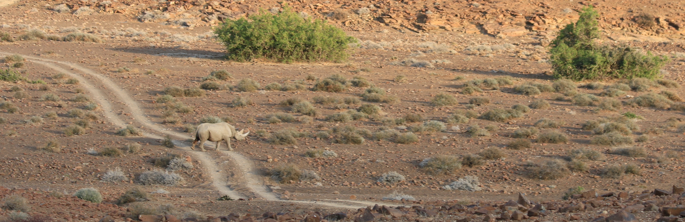

```{r setup, include=FALSE}
knitr::opts_chunk$set(echo = FALSE, R.options = list(width = 60))
source(file.path("R", "functions.R"))
library(distilltools)
```

```{css}
d-title {
    display: none;
  }
```

```{r layout="l-screen", echo=FALSE}

```

## Faculty
:::float-left


### Theresa M. Laverty, Ph.D.

Theresa Laverty (she/her) will be joining the [Department of Fish, Wildlife, and Conservation Ecology](https://fwce.nmsu.edu/) at the [New Mexico State University](https://nmsu.edu/) in January 2023 as an Assistant Professor. She is currently wrapping up a postdoc in the [Brook Lab](https://brooklab.org/) at the University of Chicago. Her research answers questions rooted in applied population and community ecology and often takes place outside of protected areas -- where humans, livestock, and wildlife interact. While she has studied diverse species (e.g., beach-nesting birds, caiman, red squirrels, elephants, and mountain gorillas), Theresa's research for the last decade has largely focused on bats. In addition to the southwestern United States, she has worked extensively in parts of Africa (Namibia, Madagascar, Kenya, and Uganda) as well as the Peruvian Amazon. She combines ecological research with social science methods to understand the basic ecology of a system, including the roles people play in the environment, in hopes of providing information that can assist managers and conservation scientists to make informed management decisions. Theresa holds a PhD in [Fish, Wildlife, and Conservation Biology](https://warnercnr.colostate.edu/fwcb/) from Colorado State University and a BA in [Ecology and Evolutionary Biology](https://eeb.princeton.edu/) from Princeton University. When she is not behind a computer or out in the field, Theresa enjoys all things outdoors—trail running, backpacking, photographing wildlife, etc.

:::

<center>
<div style="display: inline-block">
<a href="attachments/Laverty_CV.pdf" class="icon-link" target="_blank" rel="noopener"><i class=""></i> CV</a> </div><div style="display: inline-block">
<a href="https://scholar.google.com/citations?user=lbgxJ2UAAAAJ&hl=en" class="icon-link" target="_blank" rel="noopener"><i class="ai ai-google-scholar"></i> Google Scholar</a> </div>
<div style="display: inline-block"><a href="https://orcid.org/0000-0003-1727-5943" class="icon-link" target="_blank" rel="noopener"><i class="ai ai-orcid"></i> ORCID</a> </div>
<div style="display: inline-block">
<a href="https://www.researchgate.net/profile/Theresa-Laverty-2" class="icon-link" target="_blank" rel="noopener"><i class="ai ai-researchgate"></i> Research Gate</a> </div>
<div style="display: inline-block">
<a href=https://github.com/theresalaverty class="icon-link" target="_blank" rel="noopener"><i class="fab fa-github"></i> GitHub</a> </div>
<div style="display: inline-block">
<a href=https://twitter.com/theresalaverty class="icon-link" target="_blank" rel="noopener"><i class="fab fa-twitter"></i> Twitter</a></div>
<div style="display: inline-block">
<a href=mailto:tlaverty@uchicago.edu class="icon-link" target="_blank" rel="noopener"> <i class="fa fa-envelope"></i> tlaverty [at] uchicago.edu</a>
</div>
</center>


## Students

:::float-left


### This Could Be You!

Our lab is currently recruiting students. Please visit the ["Join the Lab"](opportunities.html) tab to learn more about the positions and how to apply.

:::
