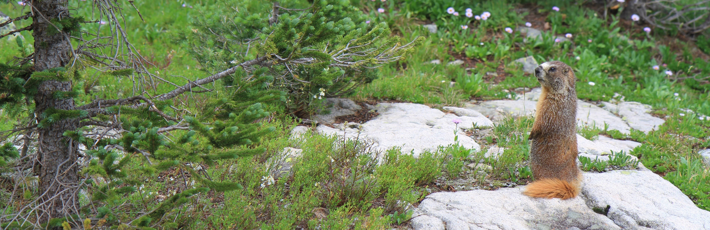

<!-- Remove margin under list items -->
<style>
p, ul{
     padding:0; 
     margin:0;
}
ul{
  margin: 0;
  padding: 0;
}
ul li{
  margin: 0;
  margin-bottom:0;
}
ul li ul{
  margin: 0;
  margin-bottom:0;
}
</style>

```{r setup, include=FALSE}
knitr::opts_chunk$set(echo = FALSE)
source(file.path("R", "functions.R"))
library(distilltools)
```

```{css}
d-title {
    display: none;
  }
```


```{r layout="l-screen", echo=FALSE}

```

<h2>Publications</h2>
<center> <p style="font-size:0.9rem">If you are unable to access any of our publications, we would be very happy to provide PDFs upon request at no cost! Just send Theresa an email at [tlaverty {at} nmsu.edu](mailto:tlaverty@nmsu.edu).</p>
</center>

## Peer-reviewed journal articles

[18]  Nelson-Olivieri JR, Layden TJ, Antunez E, Khalighifar A, Lasky M, **Laverty TM**, Sanchez KA, Shannon G, Starr S, Verahrami AK, Bombaci SP. 2023. Inequalities in noise will affect urban wildlife. Nature Ecology & Evolution. doi: [10.1038/s41559-023-02257-9](https://rdcu.be/drzoK)

<left>
<div style="display: inline-block">
<a href="https://doi.org/10.5061/dryad.s4mw6m998" class="icon-link" target="_blank" rel="noopener"><i class="ai ai-dryad"></i> Data</a> 
<div style="display: inline-block">
<a href="https://doi.org/10.5281/zenodo.7843664" class="icon-link" target="_blank" rel="noopener"><i class="ai ai-zenodo"></i> R script</a> 
</div>
</left>

[17]  Wilkins K, Carroll SL, Davis KP, Hauptfeld R, Jones MS, Larson CL, **Laverty TM**, Pejchar L. 2023. Sexual harassment disproportionately affects ecology and evolution graduate students with multiple marginalized identities in the United States. BioScience 73(5): 376–387. doi: [10.1093/biosci/biad032](https://doi.org/10.1093/biosci/biad032)

[16]  **Laverty TM**, Stoner KE. 2022. In search of bachelorettes: Observations of male Leptonycteris yerbabuenae with dorsal patches across its range. Therya 13(2): 163–170. doi: [10.12933/therya-22-1146](https://doi.org/10.12933/therya-22-1146)

<left>
<div style="display: inline-block"><a href="attachments/publications/Laverty & Stoner_2022_In search of bachelorettes- Observations of male Leptonycteris yerbabuenae with dorsal patches across its range.pdf" class="icon-link" target="_blank" rel="noopener"><i class="fa fa-file-pdf"></i> PDF</a></div><div style="display: inline-block"><a href="https://doi.org/10.6084/m9.figshare.15138702" class="icon-link" target="_blank" rel="noopener"><i class="ai ai-figshare"></i> Cited media files</a> 
</div>
</left>
[15]  Mushabati LM, Eiseb SJ, Benda P, **Laverty TM**. 2022. Effects of lunar phase and temperature on bat activity and species richness at varying altitudes in the Kunene Region, Namibia. African Journal of Ecology 60(3): 467–480. doi: [10.1111/aje.12968](https://doi.org/10.1111/aje.12968)

[14]  **Laverty TM**, Berger J. 2022. Indirect effects of African megaherbivore conservation on bat diversity in the world's oldest desert. Conservation Biology 36(2): e13780. doi: [10.1111/cobi.13780](https://doi.org/10.1111/cobi.13780)

<div style="display: inline-block"><a href="attachments/publications/Laverty & Berger_2022_Indirect effects of African megaherbivore conservation on bat diversity in the world’s oldest desert.pdf" class="icon-link" target="_blank" rel="noopener"><i class="fa fa-file-pdf"></i> PDF</a></div><div style="display: inline-block"><a href="https://warnercnr.source.colostate.edu/bats-and-behemoths-how-large-mammals-may-help-bat-diversity-in-the-worlds-oldest-desert/" class="icon-link" target="_blank" rel="noopener"><i class="fa fa-newspaper"></i> CSU Source</a> </div><div style="display: inline-block"><a href="https://doi.org/10.6084/m9.figshare.13376975" class="icon-link" target="_blank" rel="noopener"><i class="ai ai-figshare"></i> Data and R script</a> </div><div style="display: inline-block"><a href="https://code.earthengine.google.com/8ce62aac5a86cd6bc1ed1ffc43a2dae0" class="icon-link" target="_blank" rel="noopener"> <i class=""></i> Google Earth Engine script</a> </div><div style="display: inline-block"><a href="https://code.earthengine.google.com/?asset=users/theresalaverty/gps_waterquality_nofloods" class="icon-link" target="_blank" rel="noopener"><i class=""></i> Google Earth Engine asset 1</a> </div><div style="display: inline-block"><a href="https://code.earthengine.google.com/?asset=users/theresalaverty/rivers" class="icon-link" target="_blank" rel="noopener"><i class=""></i> Google Earth Engine asset 2</a> 
</div>

[13]  **Laverty TM**, Teel TL, Gawusab AA, Berger J. 2021. Listening to bats: Namibian pastoralists’ perspectives, stories, and experiences. Journal of Ethnobiology 41(1): 70–86. doi: [10.2993/0278-0771-41.1.70](https://doi.org/10.2993/0278-0771-41.1.70) [Special issue on the "Ethnobiology of Bats”]

[12]  Mans BJ, Kelava S, Pienaar R, Featherston J, de Castro MH, Quetglas J, Reeves WK, Durden LA, Miller MM, **Laverty TM**, Shao R, Takano A, Kawabata H, Moustafa MAM, Nakao R, Matsuno K, Greay TL, Evasco KL, Barker D, Barker SC. 2021. Nuclear (18S-28S rRNA) and mitochondrial genome markers of Carios (Carios) vespertilionis (Argasidae) support Carios Latreille, 1796 as a lineage embedded in the Ornithodorinae: re-classification of the Carios sensu Klompen and Oliver (1993) clade into its respective subgenera. Ticks and Tick-borne Diseases 12(4): 101688. doi: [10.1016/j.ttbdis.2021.101688](https://doi.org/10.1016/j.ttbdis.2021.101688)

[11]  Aubry LM\*, **Laverty TM**\*, Ma Z\*. 2021. Impacts of COVID-19 on ecology and evolutionary biology faculty the United States. Ecological Applications 31(2): e02265. doi: [10.1002/eap.2265](https://doi.org/10.1002/eap.2265) \* = equal lead contributions

<div style="display: inline-block"><a href="attachments/publications/Aubry et al_2021_Impacts of COVID‐19 on ecology and evolutionary biology faculty in the United States.pdf" class="icon-link" target="_blank" rel="noopener"><i class="fa fa-file-pdf"></i> PDF</a></div><div style="display: inline-block"><a href="https://warnercnr.source.colostate.edu/women-parents-and-early-career-faculty-in-ecology-most-impacted-by-covid%E2%80%9019/" class="icon-link" target="_blank" rel="noopener"><i class="fa fa-newspaper"></i> CSU Source</a> </div><div style="display: inline-block"><a href="https://www.purdue.edu/newsroom/releases/2020/Q4/non-tenured-and-female-faculty-feeling-covid-burdens,-study-says.html" class="icon-link" target="_blank" rel="noopener"><i class="fa fa-newspaper"></i> PU Agriculture News</a> </div><div style="display: inline-block"><a href="https://diverseeducation.com/article/199438/" class="icon-link" target="_blank" rel="noopener"> <i class="fa fa-newspaper"></i> Diverse: Issues in Higher Education</a> 
</div>

[10]  Orlova MV, **Laverty TM**, Reeves WK, Gratton EM, Davies ML, Anisimov NM. 2020. New geographical and host record of bat ectoparasite Steatonyssus (Steatonyssus) afer Radovsky and Yunker, 1963 (Mesostigmata: Gamasina: Macronyssidae). Acarologia 60(1): 951–958. doi: [10.24349/acarologia/20204411](https://doi.org/10.24349/acarologia/20204411)

<div style="display: inline-block"><a href="attachments/publications/Orlova et al_2020_New geographical and host record of bat ectoparasite Steatonyssus (Steatonyssus) afer.pdf" class="icon-link" target="_blank" rel="noopener"><i class="fa fa-file-pdf"></i> PDF</a>
</div>

[9]  Reeves WK, **Laverty TM**, Gratton EM, Mushabati LM, Eiseb SJ. 2020. New national records for Cyclopodia greeffi greeffi (Diptera: Nycteribiidae) from the Kunene Region, Namibia, Africa. Entomological News 129(3): 327–329. doi: [10.3157/021.129.0311](https://doi.org/10.3157/021.129.0311)

[8]  Reeves WK, Mans BJ, Durden LA, Miller MM, Gratton EM, **Laverty TM**. 2020. Rickettsia hoogstraalii and a Rickettsiella from the bat tick Argas transgariepinus, in Namibia. Journal of Parasitology 106(5): 663–669. doi: [10.1645/20-46](https://doi.org/10.1645/20-46)

[7]  **Laverty TM**, Berger J. 2020. Do bats seek clean water? A perspective on biodiversity from the Namib Desert. Biological Conservation 248: 108686. doi: [10.1016/j.biocon.2020.108686](https://doi.org/10.1016/j.biocon.2020.108686) 

<div style="display: inline-block">
<a href="https://data.mendeley.com/datasets/dz6fyzrj5p/1" class="icon-link" target="_blank" rel="noopener"><i class="ai ai-mendeley"></i> Data and R script</a> 
</div>

[6]  Orlova MV, **Laverty TM**, Reeves WK, Gratton EM, Davies ML. 2020. The first finding of parasitic mite, Parasteatonyssus nyctinomi (Mesostigmata: Gamasina: Macronyssidae), in Namibia. Journal of the South African Veterinary Association 91: a2002. doi: [10.4102/jsava.v91i0.2002](https://doi.org/10.4102/jsava.v91i0.2002)

<div style="display: inline-block"><a href="attachments/publications/Orlova et al_2020_The first finding of parasitic mite, Parasteatonyssus nyctinomi.pdf" class="icon-link" target="_blank" rel="noopener"><i class="fa fa-file-pdf"></i> PDF</a>
</div>

[5]  Orlova MV, **Laverty TM**, Reeves WK, Gratton EM, Davies ML. 2020. The first record of the spinturnicid mite Spinturnix kolenatii Oudemans, 1910 (Mesotigmata: Gamasina: Spinturnicidae) from the long-tailed serotine bat Eptesicus hottentotus A. Smith, 1833 (Chiroptera: Vespertilionidae) in Africa. International Journal of Acarology 46(3): 160–164. doi: [10.1080/01647954.2020.1731596](https://doi.org/10.1080/01647954.2020.1731596)

[4]  Jimenez MF\*, **Laverty TM**\*, Bombaci SP, Wilkins K, Bennett DE, Pejchar L. 2019. Underrepresented faculty play a disproportionate role in advancing diversity and inclusion. Nature Ecology & Evolution 3(7)​: 1030–1033. doi: [10.1038/s41559-019-0911-5](https://rdcu.be/bFvxQ) \* = equal lead contributions 

<div style="display: inline-block"><a href="attachments/publications/Jimenez et al_2019_Underrepresented faculty play a disproportionate role in advancing diversity and inclusion.pdf" class="icon-link" target="_blank" rel="noopener"><i class="fa fa-file-pdf"></i> PDF</a></div><div style="display: inline-block"><a href="https://natureecoevocommunity.nature.com/posts/catalyzing-dialogue-about-who-should-be-advancing-equity-diversity-and-inclusion-on-college-campuses-and-beyond" class="icon-link" target="_blank" rel="noopener"><i class="fa fa-newspaper"></i> Nature – After the Paper</a></div><div style="display: inline-block"><a href="https://natureecoevocommunity.nature.com/channels/521-behind-the-paper/posts/49514-how-can-we-achieve-diversity-and-inclusion-in-ecology" class="icon-link" target="_blank" rel="noopener"><i class="fa fa-newspaper"></i> Nature – Behind the Paper</a></div><div style="display: inline-block"><a href="https://warnercnr.source.colostate.edu/underrepresented-faculty-play-an-uneven-role-in-advancing-diversity-and-inclusion-study-finds/" class="icon-link" target="_blank" rel="noopener"> <i class="fa fa-newspaper"></i> CSU Source</a></div><div style="display: inline-block"><a href="https://www.the-scientist.com/news-opinion/faculty-value-diversity--though-time-and-funding-are-barriers-65961" class="icon-link" target="_blank" rel="noopener"> <i class="fa fa-newspaper"></i> The Scientist</a></div><div style="display: inline-block"><a href="https://www.insidehighered.com/news/2019/06/04/whos-doing-heavy-lifting-terms-diversity-and-inclusion-work" class="icon-link" target="_blank" rel="noopener"> <i class="fa fa-newspaper"></i> Inside Higher Ed</a>
</div>

[3]  **Laverty TM**, Teel TL, Thomas REW, Gawusab AA, Berger J. 2019. Using pastoral ideology to understand human-wildlife coexistence in arid agricultural landscapes. Conservation Science and Practice 1(5): e35. doi: [10.1111/csp2.35](https://doi.org/10.1111/csp2.35)

<div style="display: inline-block">
<a href="attachments/publications/Laverty et al_2019_Using pastoral ideology to understand human–wildlife coexistence in arid agricultural landscapes.pdf" class="icon-link" target="_blank" rel="noopener"><i class="fa fa-file-pdf"></i> PDF</a></div><div style="display: inline-block"><a href="https://phys.org/news/2019-05-namibia-pastoralists-wildlife.html" class="icon-link" target="_blank" rel="noopener"><i class="fa fa-newspaper"></i> Phys.org</a> 
</div>

[2]  Moldowan PD, **Laverty TM**, Emmans CJ, Stanley RC. 2016. Diet, gastric parasitism, and injuries of caimans (Caiman, Melanosuchus, and Paleosuchus) in the Peruvian Amazon. South American Journal of Herpetology 11(3): 176–182. doi: [10.2994/SAJH-D-16-00012.1](http://www.bioone.org/doi/10.2994/SAJH-D-16-00012.1)

[1]  **Laverty TM**, Dobson AP. 2013. Dietary overlap between Black Caimans and Spectacled Caimans in the Peruvian Amazon. Herpetologica 69(1): 91–101. doi: [10.1655/HERPETOLOGICA-D-12-00031](http://www.bioone.org/doi/abs/10.1655/HERPETOLOGICA-D-12-00031)

<div style="display: inline-block">
<a href="https://news.mongabay.com/2013/03/crocodilian-competition-may-hinder-conservation-efforts-in-amazon/" class="icon-link" target="_blank" rel="noopener"><i class="fa fa-newspaper"></i> Mongabay</a> 
</div>

## Invited book chapters

[1]  **Laverty TM**. 2020. The Namib Desert and its bats. In: Goldstein, MI, DellaSala, DA (eds.), Encyclopedia of the world's biomes, vol. 2. Oxford: Elsevier, pp. 181–192. doi: [10.1016/B978-0-12-409548-9.12011-1](https://doi.org/10.1016/B978-0-12-409548-9.12011-1)