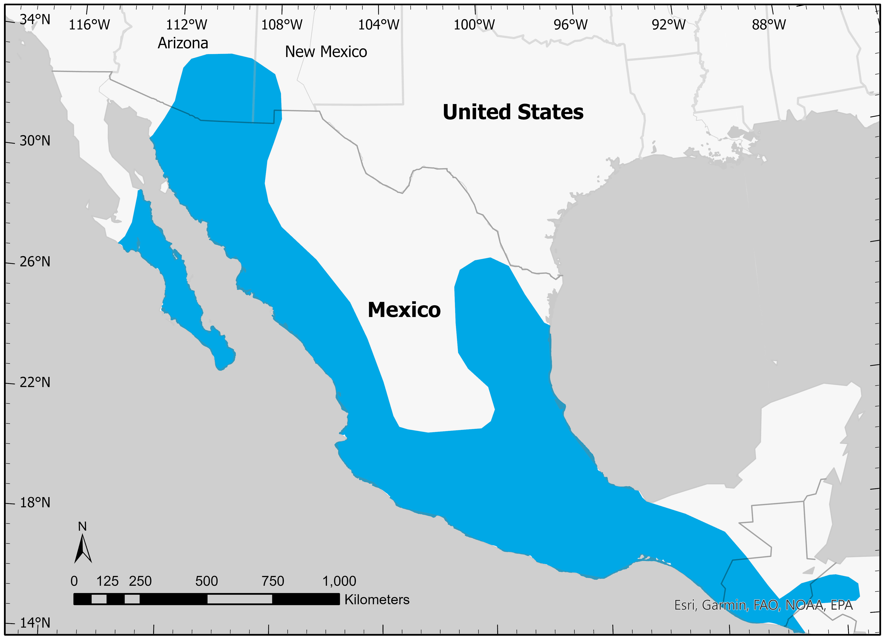

```{r setup, include=FALSE}
knitr::opts_chunk$set(echo = FALSE)
```

<style>
d-title, d-byline {
  display: none
}
</style>

<br>

````{r, fig.align = "center", out.width = "80%"}

````

# Understanding species distributions
We are interested in explaining why we find populations where we do. Our research has focused on abiotic (non-living) and biotic (living) factors that influence species distributions in relatively untouched landscapes, including factors such as [water quality](https://doi.org/10.1016/j.biocon.2020.108686) and [the activity of sympatric ecosystem engineers](https://doi.org/10.1111/cobi.13780) or local food availability. In areas where species coexist with larger densities of humans and livestock, we also assess social factors that may affect species distributions and conservation (see [“Evaluating the social dimensions of wildlife conservation”](research-social-science.html)).