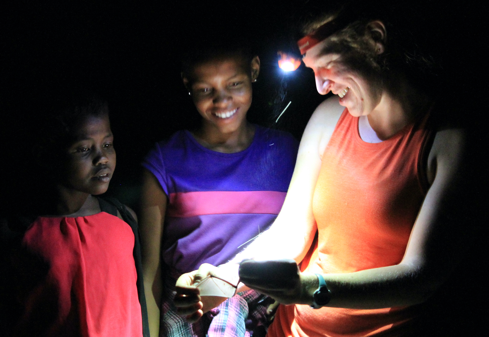

```{r setup, include=FALSE}
knitr::opts_chunk$set(echo = FALSE)
```

<style>
d-title, d-byline {
  display: none
}
</style>

<br>

````{r, fig.align = "center", out.width = "80%"}

````

# Supporting diversity, equity, and inclusion in ecology and conservation
A diverse and inclusive scientific community is more productive, innovative, impactful, and just. Through targeted research, we seek to quantify differences in behaviors that affect diversity, equity, and inclusion to expand opportunities and dismantle barriers for people from diverse and marginalized backgrounds to engage in science. Within ecology and evolutionary biology programs and in collaboration with other research groups, we have highlighted [the disproportional role](https://rdcu.be/bFvxQ) that underrepresented faculty play in advancing diversity and inclusion, [the varying effects of the COVID-19 pandemic](https://doi.org/10.1002/eap.2265) on demographic groups within faculty, [the impacts of sexual harassment](https://doi.org/10.1093/biosci/biad032) on graduate student experiences and career choices, and [the repercussions](https://rdcu.be/drzoK) of the inequitable distribution of noise in urban environments. 