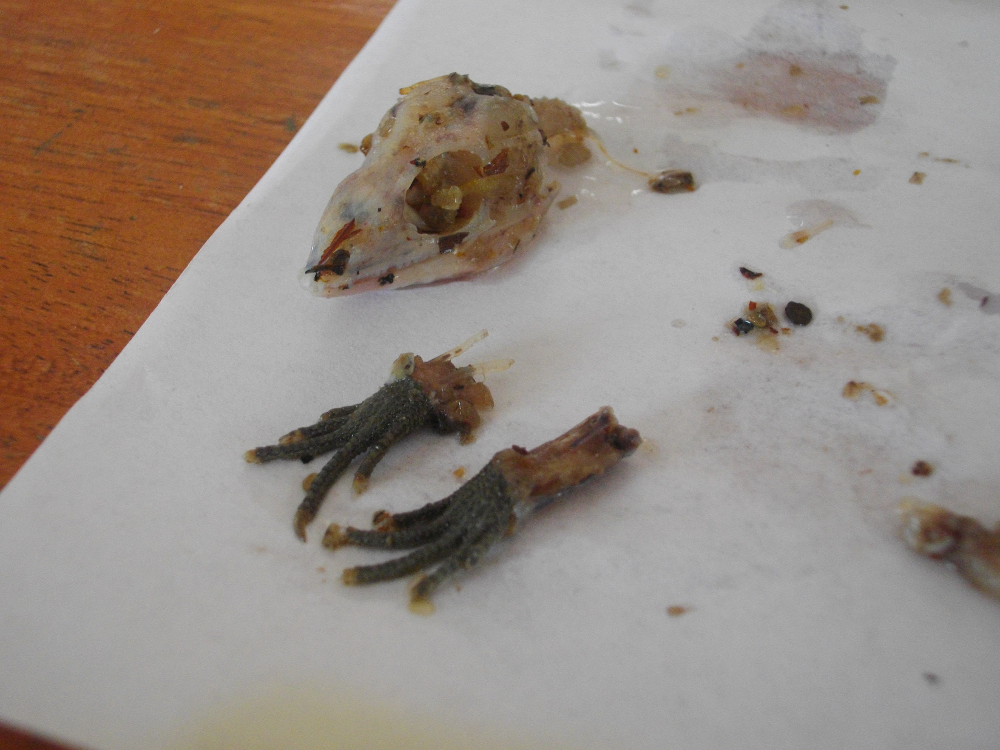

```{r setup, include=FALSE}
knitr::opts_chunk$set(echo = FALSE)
```

<style>
d-title, d-byline {
  display: none
}
</style>

<br>

````{r, fig.align = "center", out.width = "80%"}

````

# Determining food web relationships
Proper nutrition is necessary for growth, survival, reproduction, and immunity to disease. Much of our community ecology work has focused on [dietary niche overlap and differentiation](http://www.bioone.org/doi/abs/10.1655/HERPETOLOGICA-D-12-00031). We are interested in how diets differ [between species](http://www.bioone.org/doi/10.2994/SAJH-D-16-00012.1) and also how they vary at the population- and individual-level, and the associated effects on wildlife management and conservation. We also explore how diet may relate to pathogen loads and immunity in bats, and associated risks of zoonotic spillover events.