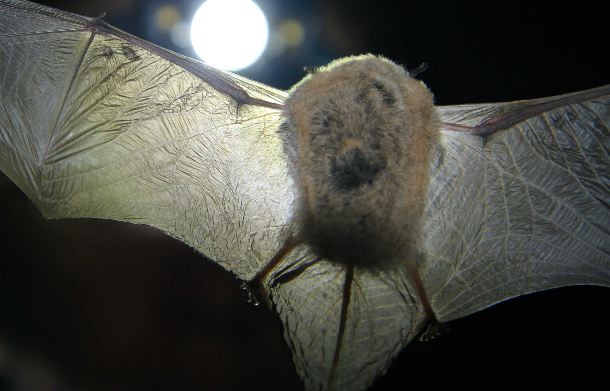

```{r setup, include=FALSE}
knitr::opts_chunk$set(echo = FALSE)
```

<style>
d-title, d-byline {
  display: none
}
</style>

<br>

````{r, fig.align = "center", out.width = "80%"}

````

# Addressing gaps in natural history
Many aspects of basic biology remain unknown for less charismatic or nocturnal species. Our research on understudied bat communities, including documenting [ectoparasite communities](https://doi.org/10.1645/20-46), [reproductive periods](https://www.revistas-conacyt.unam.mx/therya/index.php/THERYA/article/view/1146), and [activity patterns](https://www.sciencedirect.com/science/article/pii/B9780124095489120111?via%3Dihub) for bats of the northern Namib and Chihuahuan deserts, aims to address some of these important gaps in natural history to increase our understanding of the ecology and behaviors of these species. 