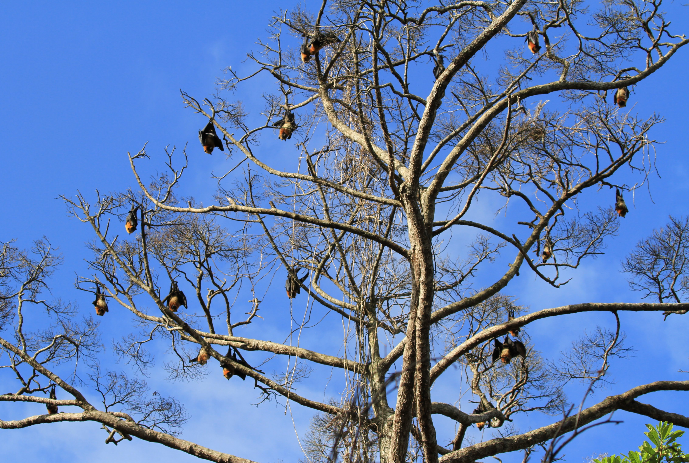

```{r setup, include=FALSE}
knitr::opts_chunk$set(echo = FALSE)
```

<style>
d-title, d-byline {
  display: none
}
</style>

<br>

````{r, fig.align = "center", out.width = "80%"}

````

# Assessing population viability and conservation needs
Extinction risk assessment is an important tool that informs and catalyzes action for biodiversity conservation and policy change. Using demographic (age at first reproduction, litter size, interbirth interval) and age-frequency data, we analyze population viability and trajectories using derivations from stage-structured Lefkovitch matrices. These results can allow for a more quantitative comparison and prioritization of management needs.