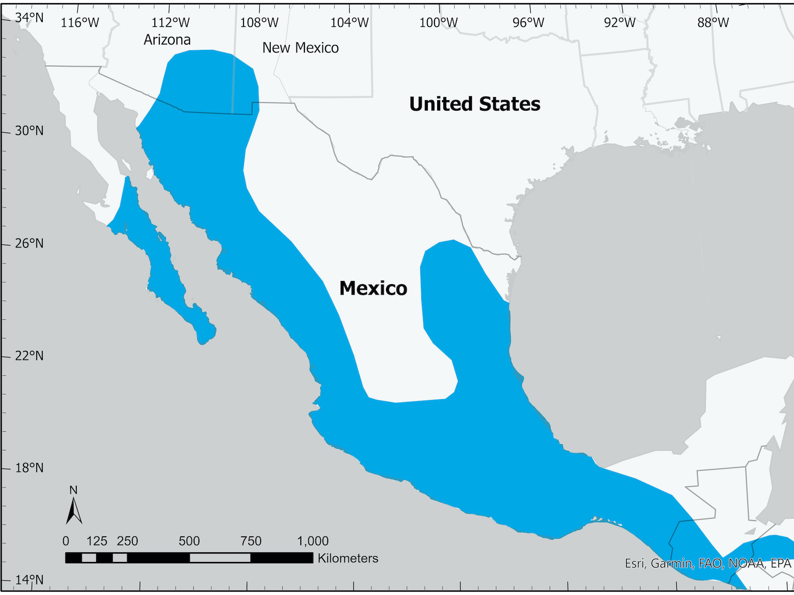

```{r setup, include=FALSE}
knitr::opts_chunk$set(echo = FALSE)
```

<style>
d-title, d-byline {
  display: none
}
</style>
```{r layout="l-screen", echo=FALSE}

```

<h2>Current Research</h2>
<div class="wrapper">

<div>
<a href = research-distributions.html>
<div class="polaroid">

<div class="container">
<h4>Understanding species distributions</h4>
</div>
</div>
</a>
</div>

<div>
<a href = research-food-webs.html>
<div class="polaroid">

<div class="container">
<h4>Determining food web relationships</h4>
</div>
</div>
</a>
</div>

<div>
<a href = research-pva.html>
<div class="polaroid">

<div class="container">
<h4>Assessing population viability and conservation needs</h4>
</div>
</div>
</a>
</div>

<div>
<a href = research-natural-history.html>
<div class="polaroid">

<div class="container">
<h4>Addressing gaps in natural history</h4>
</div>
</div>
</a>
</div>

<div>
<a href = research-social-science.html>
<div class="polaroid">

<div class="container">
<h4>Evaluating the social dimensions of wildlife conservation</h4>
</div>
</div>
</a>
</div>

<div>
<a href = research-diversity.html>
<div class="polaroid">

<div class="container">
<h4>Supporting diversity, equity, and inclusion in ecology and conservation</h4>
</div>
</div>
</a>
</div>

</div>


