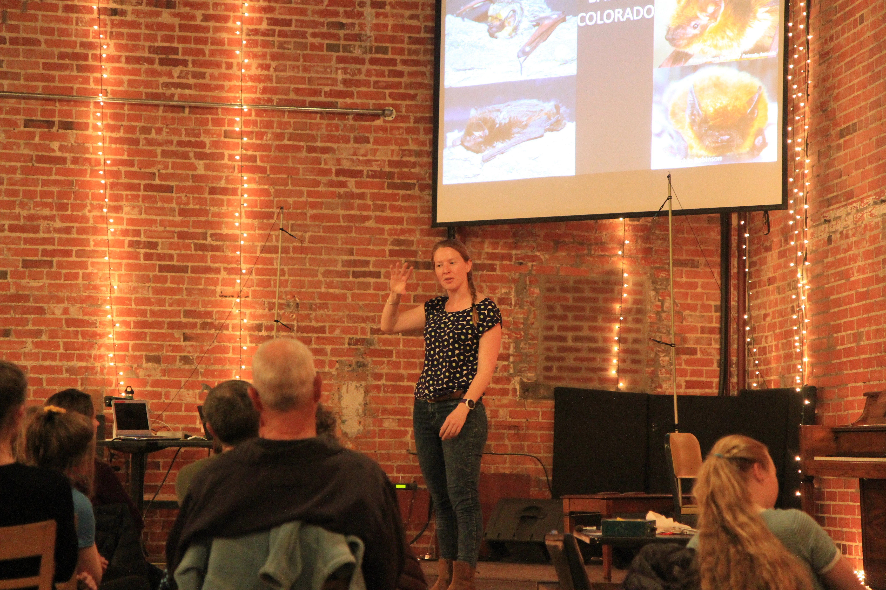

```{r setup, include=FALSE}
knitr::opts_chunk$set(echo = FALSE, R.options = list(width = 60))
source(file.path("R", "functions.R"))
library(distilltools)
```

```{css}
d-title {
    display: none;
  }
```

```{r layout="l-screen", echo=FALSE}
knitr::include_graphics("images/banners/truchaslake-2.JPG")
```

## Teaching

The opportunity to teach and mentor undergraduate and graduate students is a tremendous privilege and responsibility. I am committed to providing high quality classroom learning and mentoring experiences that train students to become natural resource leaders. In my teaching, I reflect on my own experiences as a first-generation college student to prioritize inclusive pedagogy and active learning. I teach to foster lasting learning by incorporating principles from memory research into the field, lecture, and laboratory components of the courses that I offer .

````{r, fig.align = "center", out.width = "80%", fig.cap="Theresa Laverty presenting at a Teen Science Café in Fort Collins, CO. Photo by Garrett Sisson."}

````

## Current Courses

**Natural History of the Vertebrates (FWCE 330, 4 credits), Spring semesters**

This course provides students with a foundation in vertebrate natural history, including the evolution, ecology, behavior, anatomy, and physiology of extant and extinct vertebrates. 

**Wildlife Techniques and Analysis (FWCE 355, 4 credits), Spring semesters odd years**

This course is intended to provide a broad overview of basic skills and statistical interpretation that are commonly used by biologists in performing management, research, and reporting functions in natural resource fields with an emphasis on terrestrial wildlife techniques, study design, and data processing/analysis.

**Mammalogy (FWCE 431/531, 4 credits), Spring semesters even years**

This course is offered at the undergraduate and graduate levels with an emphasis on the evolution, physiology, ecology, behavior, and conservation of mammals. Students are expected to master mammalian identification based on skulls, pelts, tracks, and signs. Materials focus on southwestern and western taxa identification with an introduction to mammalian families worldwide.


