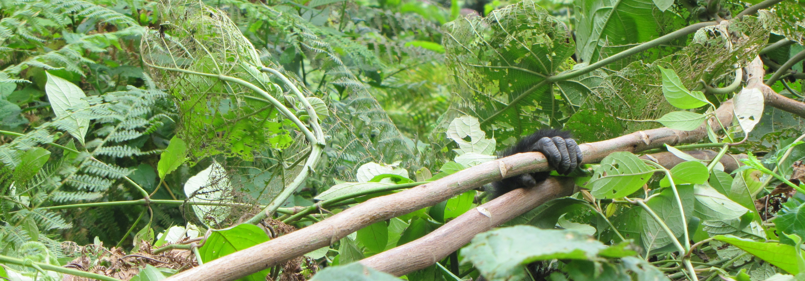

```{r setup, include=FALSE}
knitr::opts_chunk$set(echo = FALSE)
```

```{css}
d-title {
    display: none;
  }
```


```{r layout="l-screen", echo=FALSE}

```

<h2>Values</h2>
Welcome to the Laverty Lab! We study wildlife behavior at the individual-, population-, and community-levels, often with the goal of sustainably conserving  biological diversity. We also value the diversity of people with whom we engage and aim to make our research (data, [code](https://github.com/LavertyLab), and findings) available to broad audiences. 

This page borrows heavily from the superb lab value statements of the [Poisot Lab](https://poisotlab.io/) at the Université de Montréal and the [Brook Lab](https://brooklab.org/) at the University of Chicago.

## Code of conduct

The Laverty Lab is dedicated to a **harassment- and discrimination-free experience for everyone**. We recognize and celebrate that a diverse and inclusive scientific community is more productive, innovative, and impactful. We welcome and encourage diversity in our group. 

We aim to foster a positive learning environment within our lab group and when collaborating with others. Accordingly, everyone who participates in any Laverty Lab project is expected to show respect and courtesy not only to other lab members, but also to their broader academic/social community at all times. 

We ask that all members of our lab to conform to the following Code of Conduct.

  * Be kind to yourself. Be mindful of your limits and do not exhaust yourself.
  * Be kind to others. Do not insult or put down other contributors.
  * Be inclusive. Give everyone a chance to talk and an opportunity to contribute. 
  * Be culturally sensitive. Actively listen and learn from others' lived experiences.
  * Behave professionally — both online and in person. Remember that inappropriate jokes and behaviors are not tolerated. 
  * Acknowledge contributions to our work, and cite the ideas of others. Don’t pretend we work in a vacuum.
  * Respect privacy and confidentiality in cases where data or research products contain sensitive information. Do no harm.
  * Remember that research developed within the lab, especially when it involves multiple lab members, is a collective good, and that using it for spin-off ideas must have explicit consent of all persons involved.

## Flexible working hours and locations

We recognize that our group is composed of self-motivated and ambitious scientists that may choose to deviate from a traditional 9 to 5 workday in order to meet our collective goals. Consequently, we may respond to emails at odd hours, but have no expectation of others to work or respond outside of their normal working hours. Lab members may also choose to work outside of their office and hold meetings outdoors, off-campus, or over phone/video calls.

Research is project-based work, and we recognize that some weeks are long and intense — particularly when it comes to fieldwork — while others less so. We expect that members of our group work hard and take advantage of opportunities, but also encourage work-life balance. When field and class schedules permit, we expect everyone to attend our lab meetings and participate in lab activities. Social events are always optional.