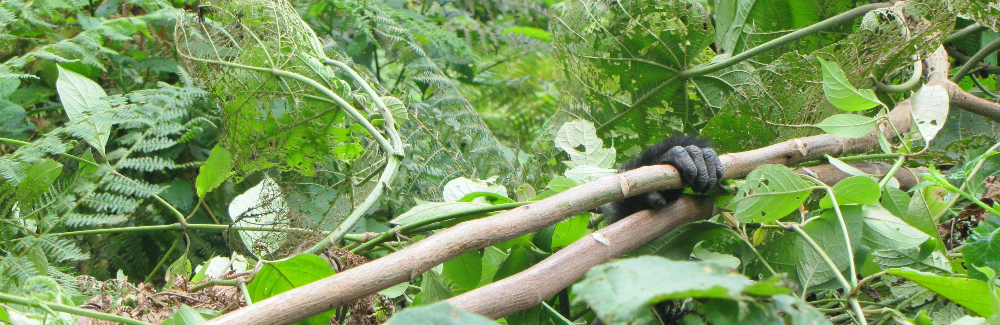

```{r setup, include=FALSE}
knitr::opts_chunk$set(echo = FALSE)
```

```{css}
d-title {
    display: none;
  }
```


```{r layout="l-screen", echo=FALSE}

```

<h2>Values</h2>
Welcome to the Laverty Lab! We study wildlife behavior at the individual-, population-, and community-levels, often with the goal of sustainably conserving  biological diversity. We also value the diversity of people with whom we engage and aim to make our research (data, [code](https://github.com/LavertyLab), and findings) available to broad audiences. 

This page borrows heavily from the superb lab value statements of the [Poisot Lab](https://poisotlab.io/) at the Université de Montréal and the [Brook Lab](https://brooklab.org/) at the University of Chicago.

## Land Acknowledgment

New Mexico State University honors Native American knowledges and worldviews based on intimate relationships to the natural world. The genesis of the Southwest Indigenous Peoples, including the Pueblo, Navajo, and Apache, established their guardianship of the lands now occupied by New Mexico State University. As the state’s Land-Grant University, we acknowledge and respect the sovereign Indian Nations and Indigenous Peoples. We pledge to have a meaningful and respectful relationship with the sovereign Indian Nations, Indigenous communities, and Native American Peoples within the institution. The Laverty Lab also promises to extend these relationships to the Indigenous communities that have called and/or continue to call our study areas home. 

## Code of conduct

The Laverty Lab is dedicated to a **harassment- and discrimination-free experience for everyone**. We recognize and celebrate that a diverse and inclusive scientific community is more productive, innovative, and impactful. We welcome and encourage diversity in our group. 

We aim to foster a positive learning environment within our lab group and when collaborating with others. Accordingly, everyone who participates in any Laverty Lab project is expected to show respect and courtesy not only to other lab members, but also to their broader academic/social community at all times. 

We ask that all members of our lab to conform to the following Code of Conduct.

  * Be kind to yourself. Be mindful of your limits and do not exhaust yourself.
  * Be kind to others. Do not insult or put down other contributors.
  * Be inclusive. Give everyone a chance to talk and an opportunity to contribute. 
  * Be culturally sensitive. Actively listen and learn from others' lived experiences.
  * Behave professionally — both online and in person. Remember that inappropriate jokes and behaviors are not tolerated. 
  * Acknowledge contributions to our work, and cite the ideas of others. Don’t pretend we work in a vacuum.
  * Respect privacy and confidentiality in cases where data or research products contain sensitive information. Do no harm.
  * Remember that research developed within the lab, especially when it involves multiple lab members, is a collective good, and that using it for spin-off ideas must have explicit consent of all persons involved.

To learn more about Dr. Laverty's advising philosophy and expectations of graduate students, please visit this [working document](https://docs.google.com/document/d/1D4177iBaGw3BkTSVnhm1vDa9mx60WFw6YIQZLR7LpEo/edit?usp=sharing) t